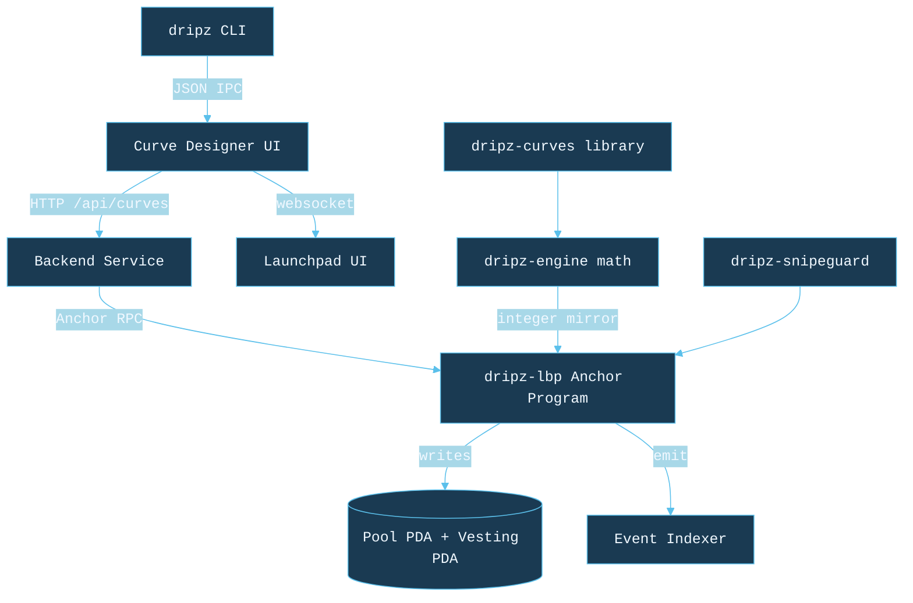

# Dripz

<p align="center">
  
</p>

> Time-weighted Liquidity Bootstrapping Pool framework for Solana. Drop by drop.

<p align="center">
  <a href="https://dripz.fi">
    
  </a>
  <a href="https://dripz.fi/docs">
    
  </a>
  <a href="https://x.com/dripzfi">
    
  </a>
  <a href="https://github.com/dripz-labs/dripz">
    
  </a>
</p>

<p align="center">
  
  
  
  
  
  
  
  
</p>

Dripz is the Solana port of Balancer V2's weighted-pool Liquidity Bootstrapping Pool design. Instead of dumping every token at launch (Pump.fun-style waterfalls), each Dripz pool releases tokens **one drop at a time** along a time-weighted curve. The result is a fairer price discovery process, dramatically lower sniper-bot impact, and a clean migration path into external CLMM pools after the auction closes.

This repository hosts the **public reference implementation**: a Rust workspace with the five curve families, the Balancer-style pool math, the anti-snipe primitives, a TypeScript curve simulator (also published on npm as [`@dripzfi/sdk`](https://www.npmjs.com/package/@dripzfi/sdk)), and a reference CLI (published as [`dripz-cli`](https://www.npmjs.com/package/dripz-cli)). The production Anchor program, Next.js Curve Designer, Launchpad UI, and FastAPI service live in the private monorepo at `dripz.fi`.

## Table of contents

1. [Overview](#overview)
2. [Architecture](#architecture)
3. [Curve families](#curve-families)
4. [Quick start](#quick-start)
5. [Library usage](#library-usage)
6. [Anti-snipe primitives](#anti-snipe-primitives)
7. [Security model](#security-model)
8. [References](#references)
9. [License](#license)

## Overview

| Feature | Notes |
| ------- | ----- |
| 5 curve families | Linear, Exponential, Step, Dutch Auction, Fair Discovery |
| Integer-only math | `u128` fixed point throughout; no floats cross the on-chain boundary |
| Anti-snipe layer | Per-tx max-buy cap + commit-reveal + rolling-window guard |
| Anti-MEV layer | Jito bundle with DontFront tip pattern (production module) |
| Vesting transition | Streamflow-compatible IDL emitted at LBP close (production module) |
| CLMM bridge | Auto-migrate remaining liquidity into CLMM hooks (production module) |

The crates in this workspace are deliberately scoped to what can be reproduced from a clone alone -- pool math, curves, snipe guard, CLI. Bundling, vesting, and CLMM migration live in the private repository because they require a live Solana mainnet wallet and an authenticated Jito searcher account.

## Program identity

The on-chain Anchor program is staged at the address below. Until the team publishes a finalized audit and runs the mainnet `solana program deploy`, the canonical program account stays uninitialized on mainnet -- callers can already pin the address in their config and the IDL is checked into the private monorepo at `packages/anchor-program/target/idl/dripz_lbp.json`.

| Field | Value |
| ----- | ----- |
| Program ID | `AsxnSxBeFwtkzxchwVDxz1VBZRuePFXBcdodfcinTrQx` |
| Anchor version | `0.31.1` |
| Cluster | `solana mainnet-beta` (staging on devnet until audit closes) |
| IDL artifact | `dripz_lbp.json` (in the private monorepo build output) |
| Authority | upgrade authority is the project multisig described in [docs/security.md](docs/security.md) |

## Architecture



Repository layout:

```
github/
├── Cargo.toml             (workspace)
├── dripz-curves/          (five curve families; integer math)
├── dripz-engine/          (Balancer V2 weighted pool math)
├── dripz-snipeguard/      (commit-reveal + max-buy + rolling window)
├── dripz-cli-demo/        (the `dripz` reference CLI)
├── sdk-demo/              (TypeScript curve simulator for the UI)
├── docs/
│   ├── architecture.md
│   ├── curves.md
│   ├── security.md
│   ├── anti-snipe.md
│   └── anti-mev.md
└── .github/workflows/     (ci.yml, release.yml)
```

## Curve families

| # | Name | Formula | Use case |
| - | ---- | ------- | -------- |
| 1 | Linear | `W(t) = W_0 - (W_0 - W_T) * t / T` | Canonical LBP shape |
| 2 | Exponential | `W(t) = W_T + (W_0 - W_T) * exp(-k * t / T)` | Aggressive snipe deterrent |
| 3 | Step | piecewise constant (4 rungs by default) | DAO launches |
| 4 | Dutch Auction | `P(t) = P_max - (P_max - P_min) * t / T` | Liquid-Launch style |
| 5 | Fair Discovery | `W(t, d) = base(t) + alpha * d` | Copper-style adaptive curve |

`d` is the realised buy-pressure signal in micro-units. See [`docs/curves.md`](docs/curves.md) for the full derivation and snipe-resistance comparison.

## Quick start

```bash
git clone https://github.com/dripz-labs/dripz.git
cd dripz

# Build the Rust workspace
cargo build --release

# Run all tests (curves, engine, snipe guard, CLI)
cargo test --workspace

# Build the TypeScript simulator
cd sdk-demo && npm install && npm test

# Or install the published packages directly
npm install -g dripz-cli
npm install @dripzfi/sdk
```

## Library usage

### Rust -- evaluate a curve

```rust
use dripz_curves::{AnyCurve, CurveParams};

let params = CurveParams::exponential(990_000, 500_000, 7 * 86_400, 3_000_000);
let curve = AnyCurve::from_params(&params)?;
let weight_at_one_day = curve.weight_token_micro(86_400)?;
println!("token weight at 24h: {} (micro-units)", weight_at_one_day);
```

### Rust -- quote a buy on a weighted pool

```rust
use dripz_engine::{PoolConfig, PoolState};

let config = PoolConfig::new("DRIPZ", "USDC", 30, curve)?;
let mut state = PoolState {
    balance_token_lamports: 10_000_000_000,
    balance_quote_lamports: 1_000_000_000,
    weight_token_micro: 990_000,
    weight_quote_micro: 10_000,
    elapsed_secs: 0,
};
state.refresh_weights(&config)?;
let quote = state.quote_buy(&config, 250_000_000)?;
println!("buy: amount_out = {} tokens, fee = {}", quote.amount_out, quote.fee_paid);
```

### TypeScript -- render a curve in the UI

```typescript
import Decimal from "decimal.js";
import { weightAt, simulateCurve } from "@dripzfi/sdk";

const config = {
  kind: "exponential" as const,
  startWeightToken: 0.99,
  endWeightToken: 0.5,
  durationSecs: 7 * 86_400,
  exponentialK: 3,
};
const steps = simulateCurve(config, {
  balanceToken: new Decimal(10_000_000_000),
  balanceQuote: new Decimal(1_000_000_000),
  startTimestampSecs: 0,
  swapFeeBps: 30,
}, { intervalSecs: 3_600 });
```

### CLI -- back-test two curves under the same demand profile

```bash
# JSON output, ready to pipe into jq or the Curve Designer
dripz backtest \
    --baseline linear \
    --candidate exponential \
    --start-weight-micro 990000 \
    --end-weight-micro 500000 \
    --duration-secs 604800
```

## Anti-snipe primitives

`dripz-snipeguard` composes three independent layers, called in order from the on-chain `buy` instruction:

1. **Per-tx max-buy cap**. During the protected window (default 300 slots) every buy is capped at `max_share_bps` of the remaining vault.
2. **Commit-reveal**. Buyers submit a SHA-256 digest of `(wallet, amount, nonce)` in slot `T` and reveal in slot `T + 1`. The digest hides the buy size, so a sniper cannot tail the order.
3. **Wallet rolling window**. The SDK and the indexer track cumulative spend per wallet inside a rolling time window and drop bundles that would breach the per-wallet cap.

See [`docs/anti-snipe.md`](docs/anti-snipe.md) for the full design and [`dripz-snipeguard/src/lib.rs`](dripz-snipeguard/src/lib.rs) for the implementation.

## Security model

- Anchor 0.31 program with PDA pool accounts and a `locked` reentrancy flag.
- Helius / Jito API keys are server-only; the wallet adapter uses the public mainnet RPC. The build pipeline `grep`s the client bundle for key leaks before shipping.
- CORS is allowlisted to `https://dripz.fi`, `https://www.dripz.fi`, `https://dripz-web.vercel.app`, and `http://localhost:3000` -- never a wildcard.
- Integer math throughout. The on-chain program and `dripz-engine` produce identical numbers for any given input.

See [`docs/security.md`](docs/security.md) for the full threat model.

## References

- [Balancer V2 weighted pool whitepaper](https://docs.balancer.fi/concepts/explore-pools/weighted-pool.html)
- [Copper LBP whitepaper](https://docs.copperlaunch.com/)
- [Liquid Token Launch](https://liquid.app/) -- Dutch auction design
- [Streamflow protocol](https://streamflow.finance/) -- vesting compatibility
- [Jito DontFront](https://docs.jito.network/) -- MEV bundle pattern
- [Anchor framework](https://www.anchor-lang.com/)

## Contributing

PRs are welcome. The CI workflow runs `cargo fmt`, `cargo build --workspace`, `cargo test --workspace`, and `npm test` on every push. Please keep the same integer-only style for any new math; floating-point cannot cross the on-chain boundary.

See [CONTRIBUTING.md](CONTRIBUTING.md) for the full workflow.

## License

MIT. See [LICENSE](LICENSE).
