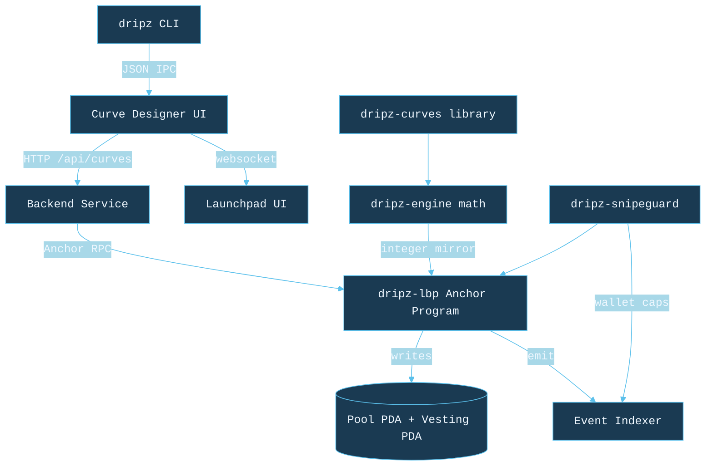

# Architecture

Dripz is split between a Rust workspace and a TypeScript reference simulator. The Rust crates compile to both standalone CLIs and on-chain Anchor program modules; the TypeScript simulator powers the Curve Designer UI and verifier tests.

## Component summary

| Layer | Crate / Package | Responsibility |
| ----- | --------------- | -------------- |
| Curve math | `dripz-curves` | Time-weighted curve evaluation (5 families) |
| Pool math | `dripz-engine` | Balancer V2 weighted pool spot price, buy / sell quoting |
| Anti-snipe | `dripz-snipeguard` | Commit-reveal, per-tx cap, rolling-window guard |
| CLI demo | `dripz-cli-demo` | `dripz design / simulate / backtest / guard` |
| SDK demo | `sdk-demo` | Curve evaluation parity for the Designer UI |

## Data flow

1. Issuer opens the Curve Designer and picks one of the five curves.
2. The Designer calls the backend simulator, which calls `dripz-engine` to render the weight trajectory.
3. When the issuer is satisfied, the Launchpad builds an Anchor transaction whose payload mirrors the same `CurveParams` struct used here.
4. On-chain, the Anchor program evaluates the same integer-only curve math and refuses buys that breach the snipe-guard layer.
5. The event indexer subscribes to the program's `Buy` / `Sell` event stream and updates the public dashboard at https://dripz.fi/launchpad.

## Integer parity

Every formula in `dripz-engine` is mirrored bit-for-bit by the on-chain Anchor program in the private monorepo. This is enforced by `cargo test` in `dripz-cli-demo::backtest::tests` and by a Solana-program-test in the launch tree. The public crate uses only `u128` and `i128`; no floating point math crosses the on-chain boundary.

## References

- [Balancer V2 weighted pool whitepaper](https://docs.balancer.fi/concepts/explore-pools/weighted-pool.html)
- [Copper LBP whitepaper](https://docs.copperlaunch.com/)
- [Liquid Token Launch](https://liquid.app/) (Dutch auction reference)
- [Streamflow protocol](https://streamflow.finance/) (Vesting compatibility)
- [Jito DontFront](https://docs.jito.network/) (MEV protection bundles)
